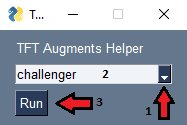
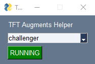
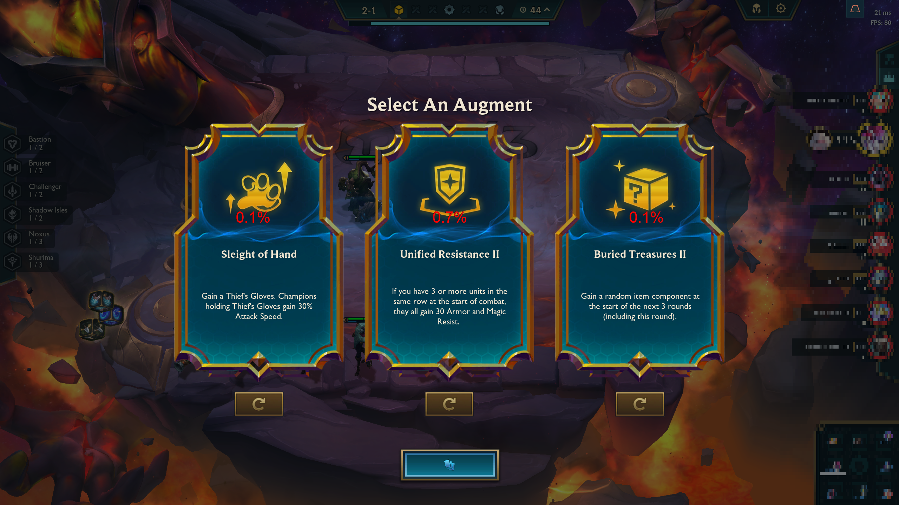
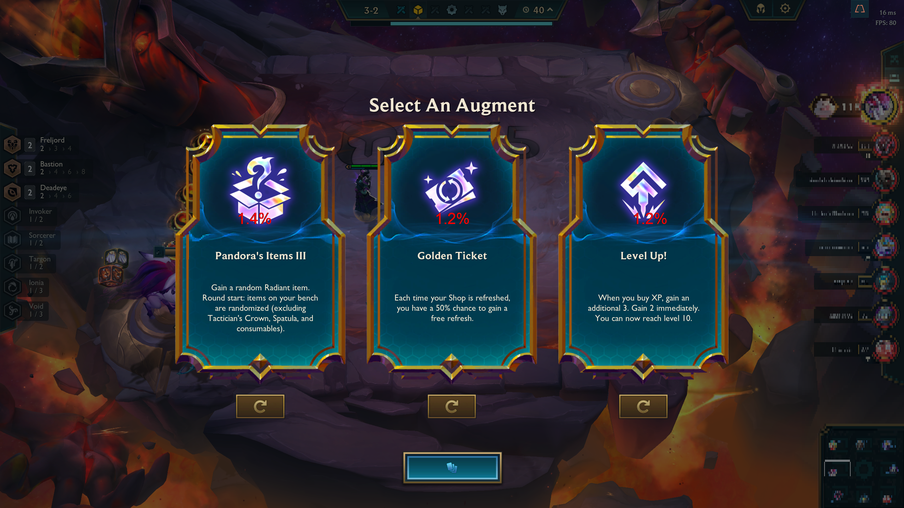

# TFT Augments Helper

TFT Augments Helper is a Python-based project that automates the collection and display of the most picked augments in Teamfight Tactics (TFT) based on player ranks. It scrapes data from a designated website daily and, when launched during augments rounds, uses Optical Character Recognition (OCR) via Tesseract to identify the augments in the game and display their pick rates according to the selected player rank.

Please note that TFT Augments Helper is currently optimized for a resolution of 2560 x 1440 and requires the installation of necessary dependencies, including Tesseract, [locally on your system ](https://tesseract-ocr.github.io/tessdoc/Installation.html).

## Disclaimer

This project is designed to work with a specific screen resolution (2560 x 1440). Using it with other resolutions may result in inaccurate results. Additionally, you must install the required dependencies, including Tesseract, before using the application.

This project does not support Hyper roll mode. The augments rounds are not at ("2-1", "3-2", "4-2").

This project does not work in WSL.
This project might not work in Linux based OS (I never installed LoL on Linux).
This project was tested with python 3.10 and windows 10.

## Features

- Daily web scraping to collect data on the most picked augments ranks (Iron, Bronze, Silver, Gold, Platinum, Diamond, Master, Grandmaster, Challenger)
- OCR-based augmentation detection during TFT rounds. ("2-1", "3-2", "4-2") Does not support Hyper roll mode at the moment. 
- Display of pick rates for augments based on the selected player rank.

## Prerequisites

Before using TFT Augments Helper, make sure you have the following prerequisites installed:

- Python (3.7 or higher)
- Tesseract OCR (local installation)
- Required Python packages in `requirements.txt`

## Usage

1. Clone this repository to your local machine.

```console
git clone https://github.com/uranium2/tft_augments_helper.git
cd tft_augments_helper
```

2. Install the required Python packages.

```console
py -m venv .venv
.venv/Scripts/activate.bat
pip install -r requirements.txt
```

Ensure that Tesseract OCR is installed and configured correctly on your system. You can download it from the official [Tesseract GitHub repository](https://github.com/UB-Mannheim/tesseract).

https://tesseract-ocr.github.io/tessdoc/Installation.html

Make sure your binary for tesseract is at `C:\Program Files\Tesseract-OCR\tesseract.exe`

4. Launch GUI

```console
py main.py
```
Select on the GUI the rank you want to check the pick rate of the augments.

5. Run

Press `Run` on the GUI and play your TfT game. It should print stuff in console every 2-5 seconds to get the round number and if needed the augments names on screen.

## Demo

- Launch code.

```console
(.venv) tft_augments_helper>py main.py
```
- Select the rank to check pick rate from drop down menu. And click `Run` before or during a TFT game.



- The button must show `Running`. Press on `Running` to stop round detection and augments pick rate search.



- In red are the pick rate of the augments from the rank you selected. You have change the rank at any time, even during augment rounds.






## TODO

- Use `translate_coordinates` to make this project work with any ratio and screen resolution.
- Clean code, make more constants
- Clean printing
- If the OCR get a too small string (Mostly after picking the augment and still in augment round), then don't search for best pick rate and don't display


## License

This project is licensed under the MIT License - see the LICENSE file for details.
